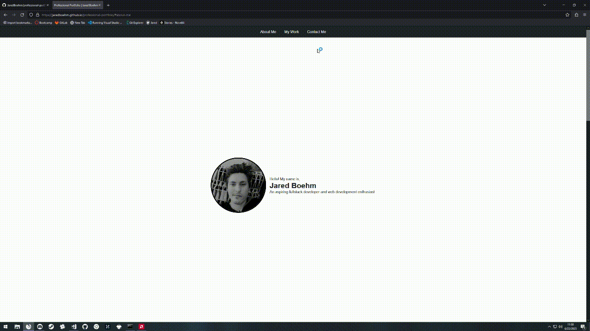

# professional-portfolio

## Description
A simple portfolio website to showcase some of my best work (or will in the future). Accessability was considered throughout the development process, as well as an effort to make the CSS concise and highly readable, with comments to perhaps an excessive extent. Images were compressed to about ~100kb for a faster loading experience.

## Credits
- Thanks to Ruandré Janse van Rensburg for the social icon SVG codes, which can be found [here.](https://codepen.io/ruandre/pen/MWXxem)
- [Autoprefixer](https://autoprefixer.github.io/) was used for all the vendor prefixes.

## Installation

NA

## Usage

The end result can be viewed [here.](https://jaredboehm.github.io/professional-portfolio/)

## License

NA
